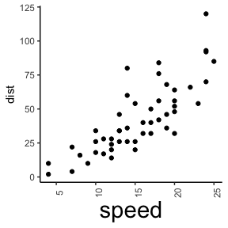

<!-- README.md is generated from README.Rmd. Please edit that file -->

ggx 
================================================================

Overview
--------

`ggplot2` is an R package for creating awesome graphics, based on [The
Grammar of Graphics](https://amzn.to/2ef1eWp). It has changed my life as
a scientist and developer. However, I have terrible memory and with the
complexity of `ggplot2`, I forget the same commands again and again. So
I often end up searching Google for help and then I copy and paste the
solution into my R script. Eventually, I wondered whether we couldn’t
save this extra step and just *talk* to ggplot in natural language
(similar to a Google search query). So, I wrote this package that let’s
you issue natural language commands that are translated into ggplot
commands. This is very likely totally bonkers, and this is how it looks:

    ggplot(data=cars,aes(x=speed, y=dist))+geom_point()+
      gg_("rotate x-axis labels by 90 degrees")+
      gg_("increase font size on x-axis")
    #> Registered S3 method overwritten by 'sets':
    #>   method        from   
    #>   print.element ggplot2
    #> Warning in gghelp(wish = wish, print = FALSE): No clear match found!

Disclaimer
----------

I am pretty sure that this package violates fundamental principles of
ggplot2. First and foremost, it would be much wiser to just study and
learn the respective commands instead of relying on fuzzy and not
well-defined natural language commands. Second, this package doesn’t
rely on fancy deep learning or other AI technology. It’s a simple
keyword matching algorithm. If someone fancies to replace this with a
better approach, please do so. Contributions to this package are more
then welcome!

Installation
------------

    # Install the development version from GitHub:
    # install.packages("devtools")
    devtools::install_github("brandmaier/ggx")

Usage Examples
--------------
